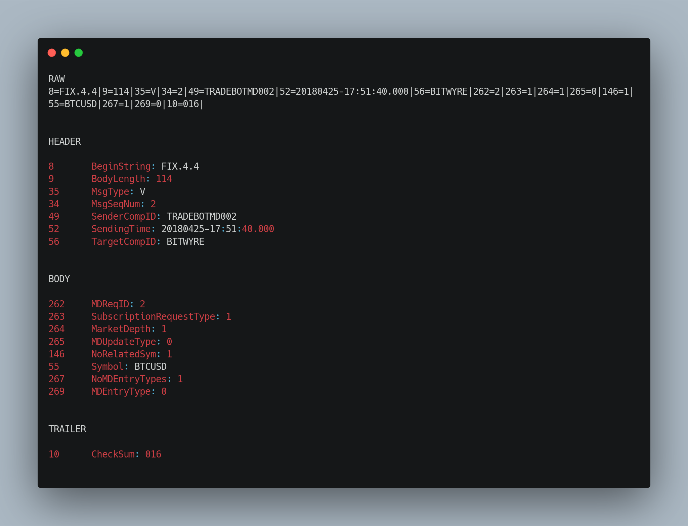

# Fix parser 

FIX stands for Financial Information eXchange protocol. 

__fixparser__ is a single header library that helps parsing a FIX message, and translate it into a human readable way. It can also be used to check if a FIX message/response is valid. The supported protocol version is FIX.4.4. Check the `spec` folder to see all the available versions.

# Building 

  ## Requirements 

  - CMAKE 3.10 or greater
  - Clang or G++ 8.3.0 (That supports C++17)
  - Conan - C/C++ package manager

  If you're not using __Conan__ you'll need to install [PugiXml](https://github.com/zeux/pugixml) and make it globally available.
  
  After all the requirements have been met, you can proceed to the "out of source" building 

  # Building and installing 
  
  Running these commands successively you will have the library built

  ```
    mkdir build && $_
    
  ```

  ```
    cmake install ..

  ```
  If you don't want to build the example included with this repository just:

  ```
    cmake install .. -DBUILD_EXAMPLES=OFF

  ```

  Also to build without tests just add the option `-DBUILD_TESTS=OFF`

  Finally make the library available widely in your system: 

  ```
    make && sudo make install 
  ```

# How to use the library

The library provides a simple interface in order to parser the message. As of now the two methods that you'll 
use most the time are: 

- `fixparser::checkMsgValidity()`: which takes any thing that a `std::string` can be constructed from and return `true`
if the message is a valid one or false otherwise. When it returns `false` meaning that the message is not valid, you can print the list of errors that occured during the parsing by printing `fixparaser::getErrors()` to the standard output.

- `fixparser::toHuman()` : Will display the parsed message in a human readable way. If the call to `fixparser::checkMsgValidity` returned false then this function will print the list of errors encountered instead.

## Basic example 

```cpp
    #include "fixparser.hpp"
    #include <iostream>

    auto main() -> int {

        std::string msg("8=FIX.4.4|9=114|35=V|34=2|49=TRADEBOTMD002|52=20180425-17:51:40.000|56=BITWYRE|262=2|263=1|264=1|265=0|146=1|55=BTCUSD|267=1|269=0|10=016|");
        
        auto isMsgValid = fixparser::checkMsgValidity(msg);

        if( isMsgValid ){
            std::cout<< fixparser::toHuman() <<"\n";
        }else{
            std::cout << fixparser::getErrors() << "\n";
        }
        return 1;
    }
```

# Sample result 



# Running the tests

# Author

- [Sonkeng Maldini](https://github.com/sdmg15)

# Licence
